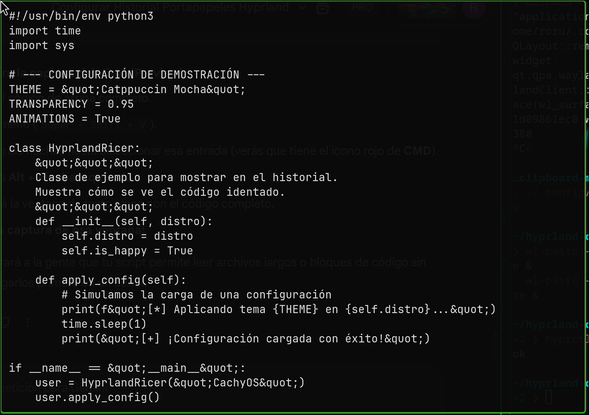

```markdown
# Hyprland Python Clipboard Manager

Un gestor de portapapeles rápido, estético y libre de errores para Hyprland, construido con **Rofi**, **Cliphist** y **Python**.

Diseñado para solucionar los problemas de "glitches" visuales, corrupción de texto y lentitud en historiales grandes, ofreciendo una interfaz compacta tipo IDE.

## ✨ Características

- **🎨 Detección Inteligente:** Distingue visualmente entre:
  - 🟥 **Comandos/Código:** (Rojo) Detecta `sudo`, `git`, `python`, etc.
  - 🟪 **Imágenes:** (Violeta) Muestra resolución y tamaño sin texto basura.
  - 🟦 **URLs/Links:** (Azul).
  - 🟨 **Keys/Secretos:** (Amarillo) Detecta `API_KEY`, direcciones cripto, etc.
- **🛡️ Sin Artefactos:** Usa Python para escapar caracteres HTML, evitando que Rofi se rompa con textos complejos o binarios.
- **⚡ Compacto:** Diseño optimizado con padding reducido y fuente Nerd Font.
- **👁️ Visor Seguro:** Previsualiza textos largos o imágenes sin ejecutar nada peligroso ni "ensuciar" tu buffer de pegado.

## 📸 Screenshots

| Menú Principal | Vista Previa de Código |
|:---:|:---:|
|  |  |

*(Asegúrate de tener instalada una Nerd Font para ver los iconos correctamente)*

## 📦 Dependencias

Este script requiere Python y las herramientas estándar de Wayland.

**Arch Linux / CachyOS:**

```bash
sudo pacman -S python rofi-wayland cliphist wl-clipboard grim slurp

```

## 🚀 Instalación

Sigue estos 4 pasos sencillos:

### 1. Descargar el Script

Baja el archivo `clipboard_manager.py` de este repositorio y guárdalo en tu carpeta de scripts (por ejemplo, `~/.config/hypr/scripts/`).

### 2. Dar Permisos

Haz que el script sea ejecutable:

```bash
chmod +x ~/.config/hypr/scripts/clipboard_manager.py

```

### 3. Configurar Hyprland

Edita tu archivo de configuración `~/.config/hypr/hyprland.conf`.

**Añade estas líneas al inicio (Inicio Automático):**
Es importante usar dos líneas separadas para texto e imágenes para evitar la corrupción de la base de datos de cliphist.

```ini
exec-once = wl-paste --type text --watch cliphist store
exec-once = wl-paste --type image --watch cliphist store

```

**Añade el atajo de teclado (Bind):**

```ini
bind = SUPER SHIFT, V, exec, ~/.config/hypr/scripts/clipboard_manager.py

```

### 4. Aplicar Cambios

Reinicia Hyprland o recarga la configuración para que los cambios surtan efecto:

```bash
hyprctl reload

```

## ⌨️ Uso y Atajos

Una vez abierto el menú con `Super + Shift + V`:

| Tecla | Acción |
| --- | --- |
| **Enter** | Copia el elemento seleccionado y cierra el menú. |
| **Alt + Izquierda** | **Vista Previa / Visor:** Abre una ventana limpia para leer textos largos, código completo o ver qué contiene una imagen sin copiarla. |
| **Alt + Derecha** | **Borrar:** Elimina el elemento seleccionado del historial permanentemente. |
| **Esc** | Cerrar el menú. |

```

```
